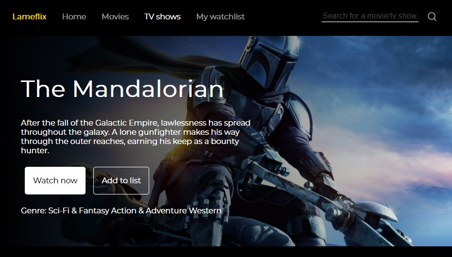

# Lameflix

a Netflix clone built in React for learning purposes

[LIVE DEMO](http://bartektelec.github.io/react-netflix-clone/)

- UI inspired of Netflix
- Design system built using @storybook
- Gett movies from Movie Database API and show them as cards
- Search for movies and TV series
- When card is clicked on, it displays more details about the movie
- Add movies to watch list

## Credits

- [react 16.13.0](https://github.com/facebook/react-native)
- [styled-components 5.0.1](https://github.com/styled-components/styled-components)
- [prop-types 15.7.2](https://github.com/facebook/prop-types)
- [react-router 5.1.2](https://github.com/ReactTraining/react-router)
- [storybook 5.3.14](https://github.com/storybookjs/storybook)
- [netflix](https://netflix.com/)
- [the movies db api](https://developers.themoviedb.org/3)

## Further plans

- Lack of tests
- Remove unused dependencies
- Add ability to remove items from the _watchlist_
